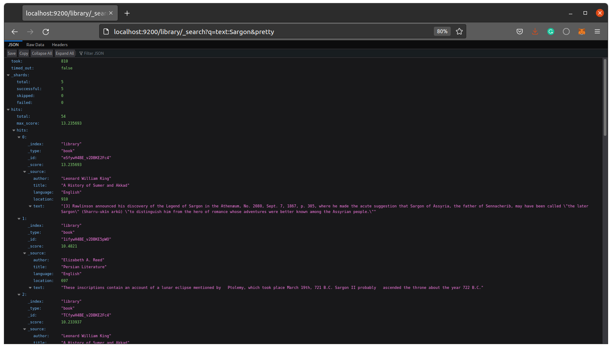
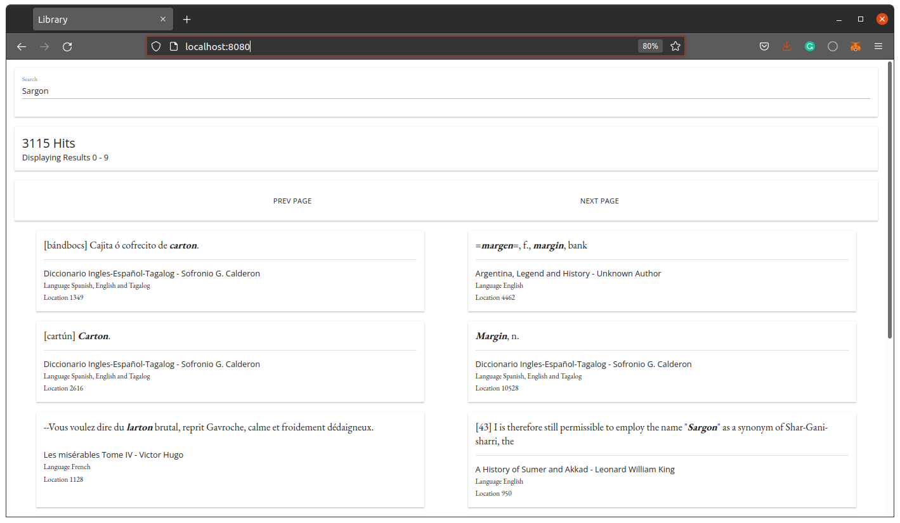
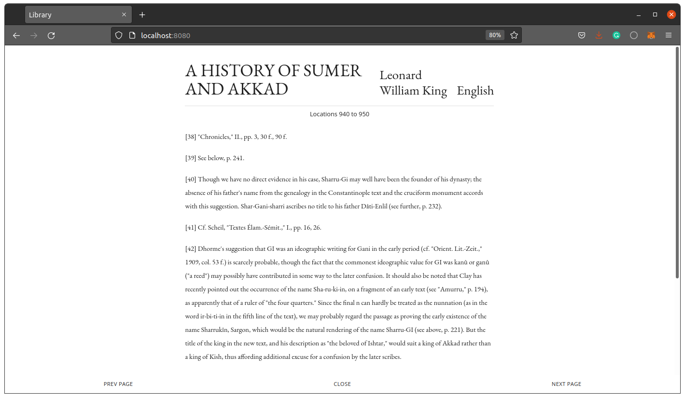

# Project 4 – PRIMARY CHOICE Book Search Engine
Sebastian Celeita Student ID 28716405
___
### Download sample books
If you haven't download Gutemberg Project books, please feel 
free to download near 200 books in english, spanish and french from the following source:
https://drive.google.com/file/d/1XVj5EEJNnBBNwwx1zkoO9A4IdExa0sBl/view?usp=sharing

Make sure you copy all the .txt files into */books* existing folder in the project directory

### Install Docker
Depending on your local host system please follow the instructions as suggested in:
- Install Docker - https://docs.docker.com/engine/installation/
- Install Docker Compose - https://docs.docker.com/compose/install/

### Build Application Container
Run the wollowing command, it will take a while to download the image and dependencies to customize it:

    docker-compose build
You should see:

    frontend uses an image, skipping
    elasticsearch uses an image, skipping
    Building api
    Sending build context to Docker daemon  391.7kB
    Step 1/6 : FROM node:carbon
     ---> 8eeadf3757f4
    Step 2/6 : WORKDIR /usr/src/app
     ---> Using cache
     ---> 04d7c2e2d978
    Step 3/6 : COPY package*.json ./
     ---> 2c0f602af62b
    Step 4/6 : RUN npm install
     ---> Running in 61170e2408dc
    added 141 packages from 59 contributors and audited 141 packages in 7.281s
    
    33 packages are looking for funding
      run `npm fund` for details
    
    found 7 vulnerabilities (1 low, 2 moderate, 3 high, 1 critical)
      run `npm audit fix` to fix them, or `npm audit` for details
    Removing intermediate container 61170e2408dc
     ---> c704f6db939b
    Step 5/6 : COPY . .
     ---> 600751f7e8bd
    Step 6/6 : CMD [ "npm", "start" ]
     ---> Running in 393dea52b8bd
    Removing intermediate container 393dea52b8bd
     ---> ef45bf8a8de2
    Successfully built ef45bf8a8de2
    Successfully tagged daar-choice-a-final-assignment-celeita_sebastian_api:latest
### Launch full application stack
Run the following command, This step might take a few minutes since Docker has to download the base images for each container:

    docker-compose up
You should see:

    Creating network "daar-choice-a-final-assignment-celeita_sebastian_default" with the default driver
    Creating volume "daar-choice-a-final-assignment-celeita_sebastian_esdata" with default driver
    Creating gs-search   ... done
    Creating gs-api      ... done
    Creating gs-frontend ... done
    Attaching to gs-frontend, gs-api, gs-search

### Load data into Elasticsearch
Check the connection via HTTP http://localhost:9200/_cat/health?v you should see something like:

    epoch      timestamp cluster        status node.total node.data shards pri relo init unassign pending_tasks max_task_wait_time active_shards_percent
    1643981011 13:23:31  docker-cluster yellow          1         1      8   8    0    0        8             0                  -                 50.0%
Run the following command to upload all documents in */books* to the Datastore Elasticsearch instance:

    docker exec gs-api "node" "server/load_data.js"

It should start uploading files:

    $ docker exec gs-api "node" "server/load_data.js"
    Connecting to ES
    { cluster_name: 'docker-cluster',
      status: 'yellow',
      timed_out: false,
      number_of_nodes: 1,
      number_of_data_nodes: 1,
      active_primary_shards: 7,
      active_shards: 7,
      relocating_shards: 0,
      initializing_shards: 0,
      unassigned_shards: 7,
      delayed_unassigned_shards: 0,
      number_of_pending_tasks: 0,
      number_of_in_flight_fetch: 0,
      task_max_waiting_in_queue_millis: 0,
      active_shards_percent_as_number: 50 }
    Found 193 Files
    Reading File - 10.txt
    Reading Book - The King James Bible By Unknown Author written_in English
    Parsed 24609 Paragraphs
    
    Indexed Paragraphs 1 - 500
    Indexed Paragraphs 501 - 1000
    Indexed Paragraphs 1001 - 1500
    ...

### Search directly to Datastore
For the purpose of this project, the Elasticsearch interface is exposed to the Docker client
meaning that a direct search can be done via HTTP with a JSON respons.
Try in the web browser http://localhost:9200/library/_search?q=text:Sargon&pretty

You should get:

### UI Book search engine
As a final user, we can access to the book search engine via HTTP to the NGINX container service
http://localhost:8080/

By default the application will try to find the word Sargon:

You can explore each book in the paragraph that has matched the search query:

### Changes and updates
If you have done any change and want to redeploy the stack to push the updates, run the following command:

    docker-compose up -d --build

___